# CS611 FINAL PROJECT  
## LEGENDS OF VALOR  
\---------------------------------------------------------------------------  
Name: Serena Noboudem  
Email: [serenanm@bu.edu](mailto:serenanm@bu.edu)   
ID: U63767551

Name: Chris Mary Benson  
Email: [chris27@bu.edu](mailto:chris27@bu.edu)  
ID: U56085268

Name: Ziyang Wang  
Email: [zywang1@bu.edu](mailto:zywang1@bu.edu)   
ID: U12285471

**Github Link**: https://github.com/N-serena/LegendsOfValors/tree/p3

## File Structure
\---------------------------------------------------------------------------  
LegendsOfValors  
├── ReadMe\_FinalProject.md  
├── out/  
└── LegendsOfValors  
├── .idea/  
│   ├── .gitignore  
│   ├── aws.xml  
│   ├── copilot.data.migration.agent.xml  
│   ├── copilot.data.migration.ask.xml  
│   ├── copilot.data.migration.ask2agent.xml  
│   ├── copilot.data.migration.edit.xml  
│   ├── misc.xml  
│   ├── modules.xml  
│   ├── uiDesigner.xml  
│   └── vcs.xml  
├── HeroesAndMonsters.iml  
├── ReadMe\_FinalProject.md  
├── data\_files/  
│   ├── Armory.txt  
│   ├── Dragons.txt  
│   ├── Exoskeletons.txt  
│   ├── FireSpells.txt  
│   ├── IceSpells.txt  
│   ├── Initial.txt  
│   ├── LightningSpells.txt  
│   ├── Paladins.txt  
│   ├── Potions.txt  
│   ├── Sorcerers.txt  
│   ├── Spirits.txt  
│   ├── Warriors.txt  
│   └── Weaponry.txt  
├── out/  
├── out8/  
├── runinstruction.png
└── README.md  
├── LegendsOfValors_DesignDocument.pdf  
├── runs/  
│   ├── img.png  
│   ├── img_1.png  
│   ├── img_2.png  
│   ├── img_3.png
│   ├── img_4.png
│   ├── img_5.png
│   ├── img_6.png
│   ├── img_7.png
│   ├── img_8.png
│   ├── img_9.png
│   ├── img_10.png
│   ├── img_11.png
│   ├── img_12.png
│   ├── img_13.png
│   ├── img_14.png
│   └── img_15.png
├── soundfiles/  
│   └── themes.wav  
└── src/  
├── GameLauncher.java  
├── Main.java  
├── core/  
│   ├── interfaces/  
│   │   ├── Board.java  
│   │   ├── FightStrategy.java  
│   │   ├── GameEngine.java  
│   │   ├── HeroEventNotifier.java  
│   │   └── HeroObserver.java  
│   ├── model/  
│   │   ├── GameDatabase.java  
│   │   ├── Party.java  
│   │   ├── entity/  
│   │   │   ├── Dragon.java  
│   │   │   ├── Exoskeleton.java  
│   │   │   ├── Hero.java  
│   │   │   ├── LivingEntity.java  
│   │   │   ├── Monster.java  
│   │   │   ├── Paladin.java  
│   │   │   ├── Sorcerer.java  
│   │   │   ├── Spirit.java  
│   │   │   ├── Warrior.java  
│   │   │   └── decorator/  
│   │   │       └── HeroDecorator.java  
│   │   ├── item/  
│   │   │   ├── Armor.java  
│   │   │   ├── Item.java  
│   │   │   ├── Potion.java  
│   │   │   ├── Weapon.java  
│   │   │   └── spell/  
│   │   │       ├── FireSpell.java  
│   │   │       ├── IceSpell.java  
│   │   │       ├── LightningSpell.java  
│   │   │       └── Spell.java  
│   │   ├── market/  
│   │   │   └── Market.java  
│   │   └── world/  
│   │       ├── Board.java  
│   │       ├── CommonTile.java  
│   │       ├── InaccessibleTile.java  
│   │       ├── MarketTile.java  
│   │       └── Tile.java  
│   └── util/  
│       ├── Colors.java  
│       ├── GameConfig.java  
│       ├── GameDataParser.java  
│       └── SoundPlayer.java  
└── games/  
├── commoncontrollers/  
│   ├── BattleController.java  
│   ├── GameController.java  
│   ├── HeroController.java  
│   ├── InputHandler.java  
│   ├── InventoryController.java  
│   ├── MarketController.java  
│   ├── PartyController.java  
│   └── actions/  
│       ├── Attack.java  
│       └── CastSpell.java  
├── legendsofvalors/  
│   ├── commands/  
│   │   ├── AbstractCombatCommand.java  
│   │   ├── AttackCommand.java  
│   │   ├── CastSpellCommand.java  
│   │   ├── MoveCommand.java  
│   │   ├── RecallCommand.java  
│   │   └── TeleportCommand.java  
│   ├── controller/  
│   │   ├── LovGameController.java  
│   │   ├── LoVHeroController.java  
│   │   └── battle/  
│   │       ├── LoVBattle.java  
│   │       └── LoVBattleProxy.java  
│   ├── interfaces/  
│   │   ├── Battle.java  
│   │   ├── LovCommand.java  
│   │   └── LovGameState.java  
│   ├── model/  
│   │   ├── ValorHero.java  
│   │   ├── ValorMonster.java  
│   │   ├── factory/  
│   │   │   └── MonsterFactory.java  
│   │   └── world/  
│   │       ├── BoardRenderer.java  
│   │       ├── LovBoard.java  
│   │       ├── LovTile.java  
│   │       ├── MonsterAI.java  
│   │       └── generator/  
│   │           ├── RandomTerrainGenerator.java  
│   │           └── TerrainGenerator.java  
│   ├── states/  
│   │   ├── HeroTurnState.java  
│   │   ├── MonsterTurnState.java  
│   │   └── RoundEndState.java  
│   ├── testing/  
│   │   └── LovGameSmokeTest.java  
│   └── util/  
│       └── GameConfig.java  
└── monstersandheroes/  
├── controller/  
│   ├── GuildController.java  
│   ├── MHGameController.java  
│   └── MonstersAndHeroesBattleController.java  
├── model/  
│   └── Board.java  
└── view/  
├── Colors.java  
└── GameView.java

## How To Compile  
\---------------------------------------------------------------------------

1. Open PowerShell and change into the project root: cd LegendsOfValors-.../LegendsOfValors-....
2. Create the compilation output directory if it does not exist: mkdir out.
3. Generate a response file listing every source: Get-ChildItem \-Path .\\src \-Recurse \-Filter \*.java | ForEach-Object { $\_.FullName } | Set-Content \-Path .\\out\\sources.txt.
4. Compile all sources with UTF-8 encoding: javac \-encoding UTF-8 \-d out \-cp src @out\\sources.txt.
5. Launch the game: java \-cp out Main.

## Notes  
\---------------------------------------------------------------------------

###  Monster AI
* Each monster evaluates nearby hero positions every turn using risk-adjusted Manhattan distances.
* Decision types include advance, retreat, evade, and attack, prioritising survival when health or defense is low.
* Target selection favors wounded heroes first, then the highest offensive threat.
* Movement scoring balances lane progress, combat opportunities, and obstacle penalties before issuing a command.

## Input/Output Example  
\---------------------------------------------------------------------------

# Startup Menu and Mode Selection  
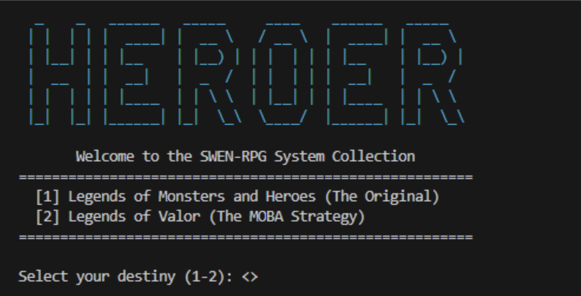

# Legends of Valor mission briefing and map  
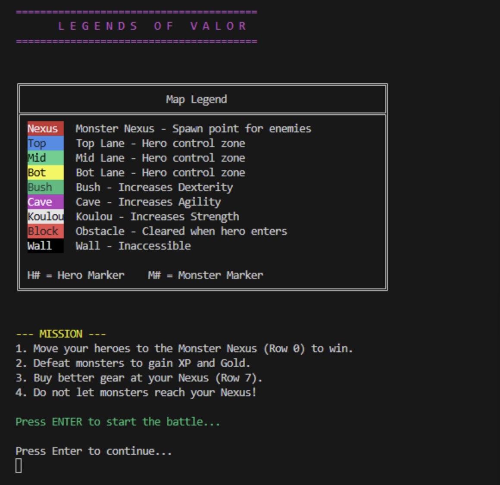

# Hero assignment, equipment tips, and turn interface
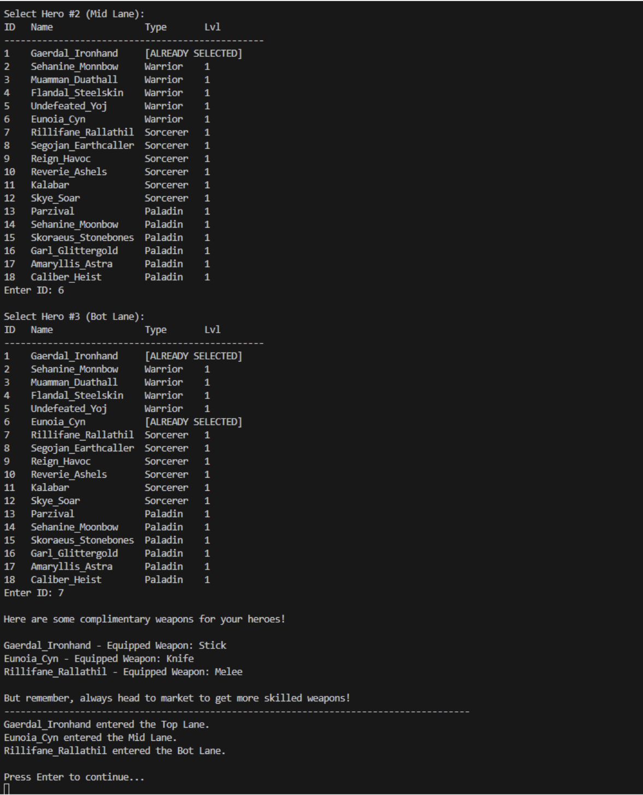
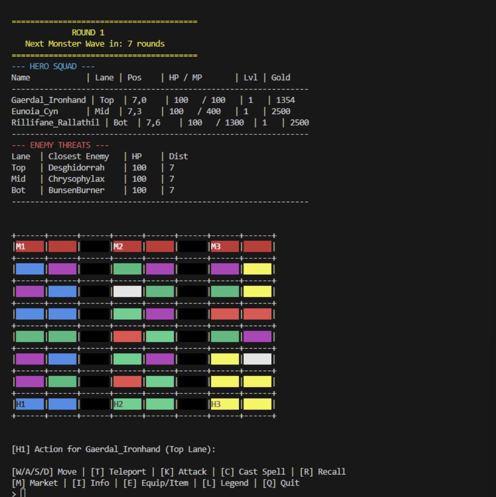
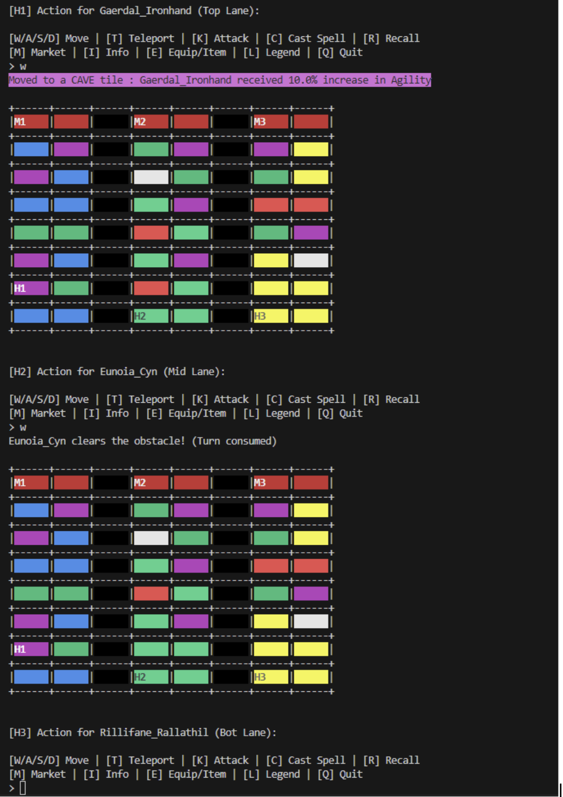

# Terrain Advantages, Obstacle Removal, and Combat Feedback
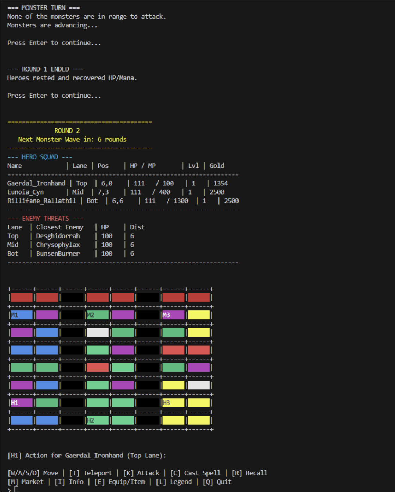
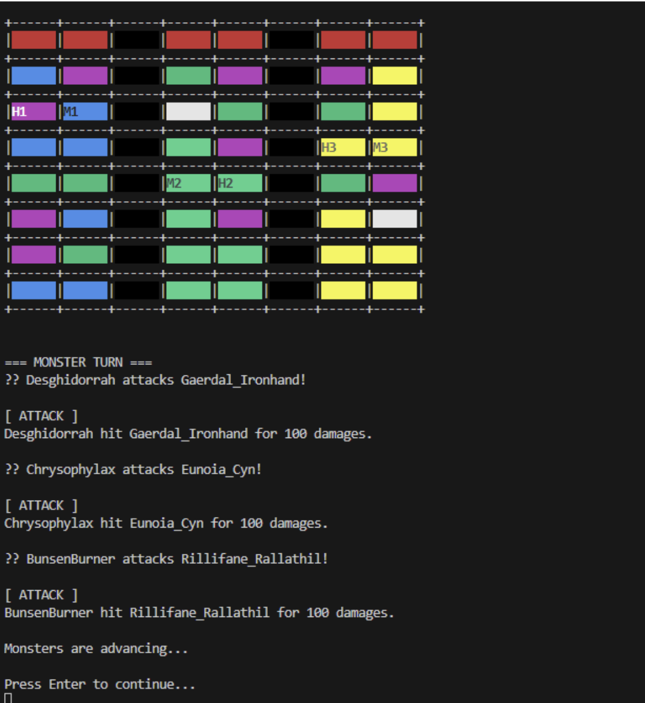
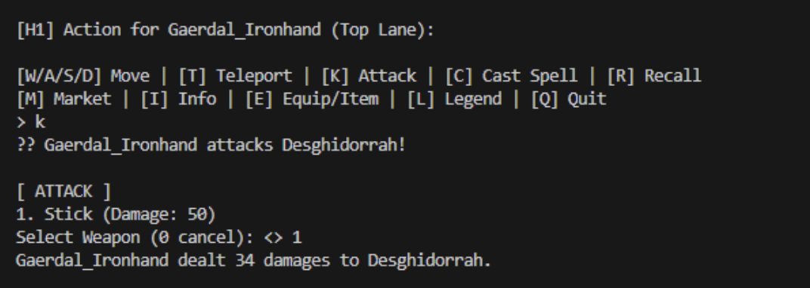
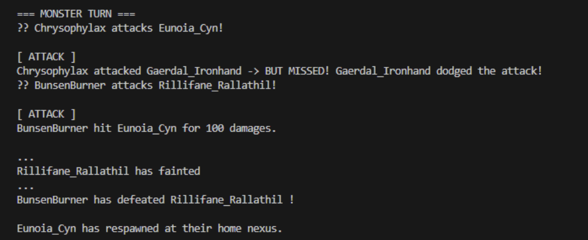

# Teleportation Support and High Turn Information Display  
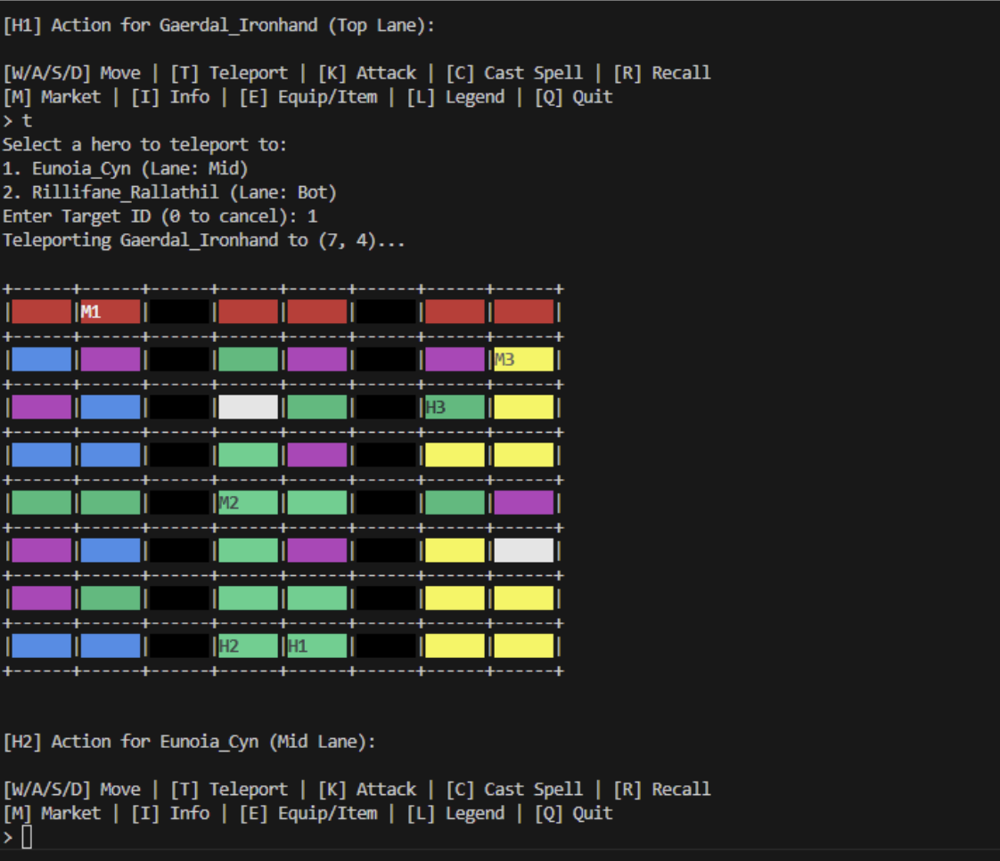
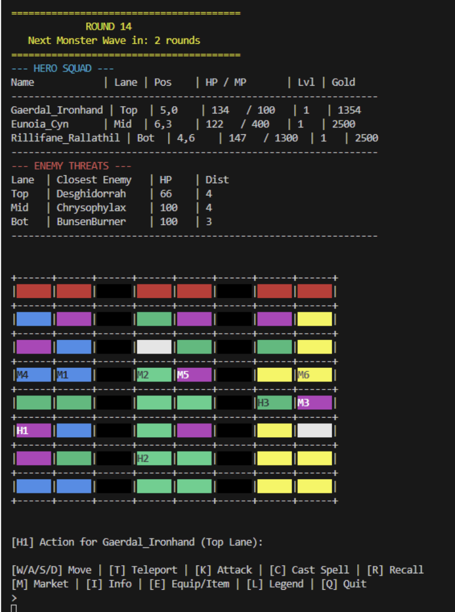

# Victory (Heroes win)
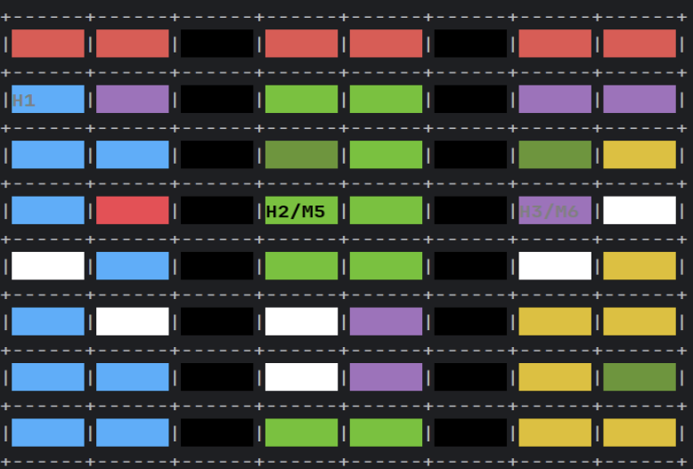
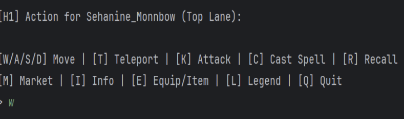
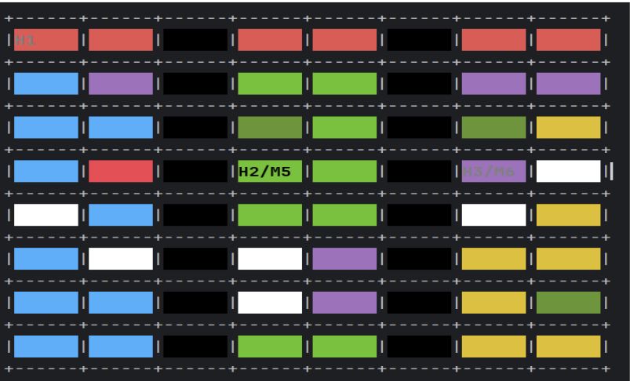
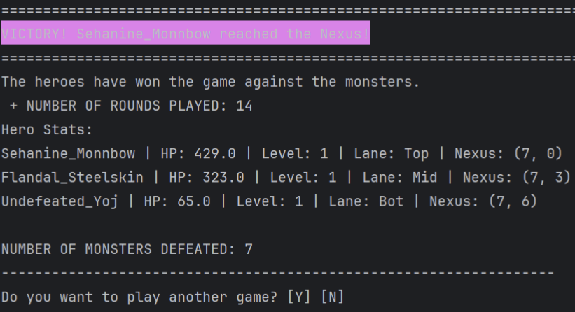

# Victory (Monsters win)
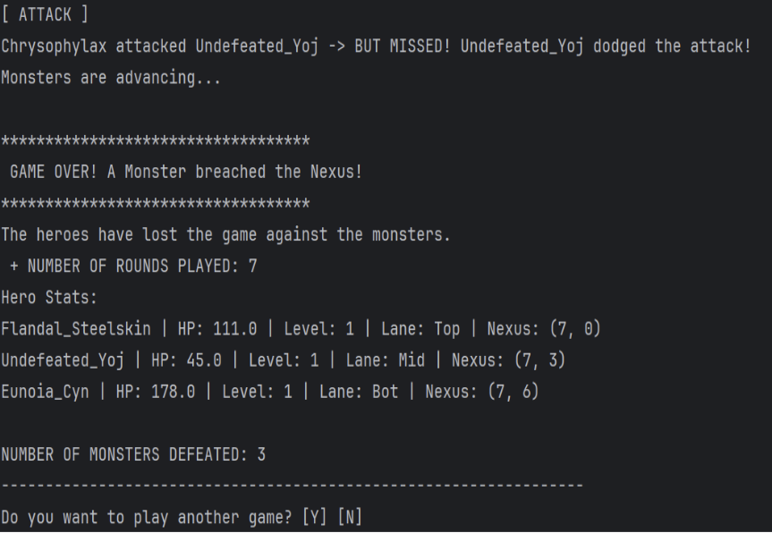